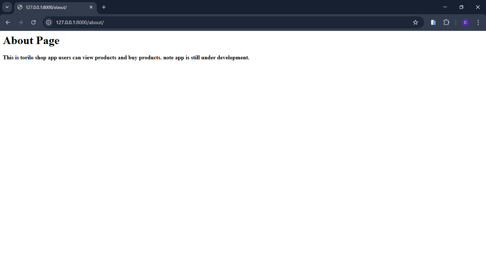
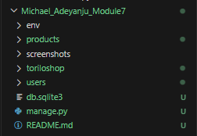

### PROJECT DESCRIPTION 
    WHAT IS TORILO SHOP: torilo shop is a backend E - commerce app .

    WHAT DOES TORILO SHOP DO : its an app that displayes products for 
users and allows users to buy products. the backend allows the user to be able to buy and 
sell products.

## TORILO SHOP FEATURES 

| FEATURES                      | FEATURE CODE                        | URL FOR THE FEATURE
|-------------------------------|-------------------------------------|---------------------------------------------------------------------|
| 1. View products              |   in the products views.py we used  | url : products/ is the path in the url 
|                               | the product_list view to            | to view the products in the browser.
|                               | display products to user.           |
|-------------------------------|-------------------------------------|----------------------------------------------------------------------|
| 2. about                      |   in the product views.py we used   | url : about/ is the path in the url to 
|                               | the about view to let users now     | view the about info of torilo shop in the 
|                               | about torilo shop.                  | browser.
|-------------------------------|-------------------------------------|----------------------------------------------------------------------|
| 3. home                       |   in the products views.py we used  | url : we use the / since its the first page users are going to
|                               | the home view to display a welcome  | view.
|                               | message to the users                |
|-------------------------------|-------------------------------------|----------------------------------------------------------------------|
| 4. 404 page                   |  in the products views.py we created| re_path(r'^.*$', page_not_found) we use the repath module 
|                               | a view to detect if a url entered is| to check for the invalid urls entered by user. its defined 
|                               | actually an existing defined url if | in the root url of the project.
|                               | not it displayes a 404 page.        |
|_______________________________|_____________________________________|______________________________________________________________________|

## SETUP INSTRUCTIONS
1. CREATE A VIRTUAL ENVRONMENT: py -m venv env would create a virtual env 
2. ACTIVATE THE VIRTUAL ENVIRONMENT: env\Scripts\Activate would activate the virtual env
3. INSTALL DJANGO:  pip install django would install django in your vitual env 
4. RUN SERVER : py manage.py runserver - this would start the development server note default port is 8000

# SCREEN SHOTS 
1. HOME PAGE  
2. PRODUCT PAGE 
3. ABOUT PAGE 
4. PROJECT STRUCTURE 
